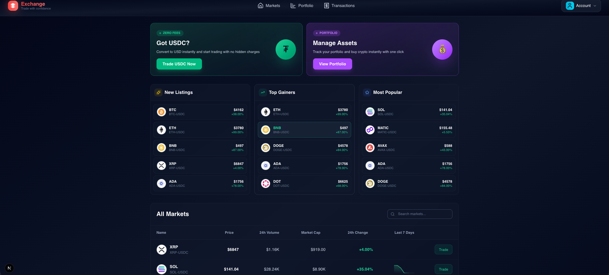
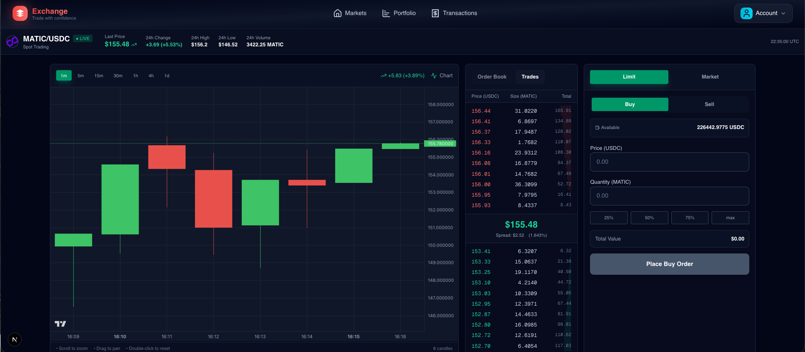
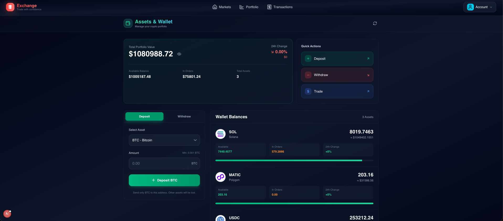
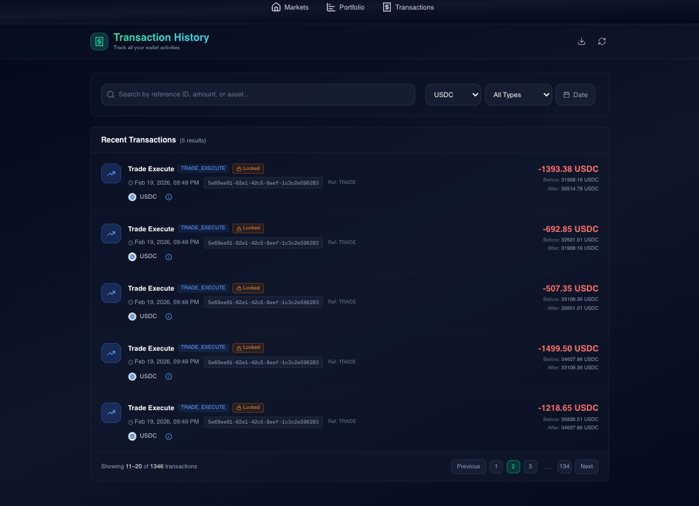

# 🚀 Centralized Exchange (CEX)

A production-grade, event-driven cryptocurrency exchange built with scalable architecture, low-latency matching engine, and real-time market data streaming.

Designed with separation of concerns, high throughput, crash recovery, and financial consistency in mind.

---

## 🧱 Architecture

This exchange follows an **event-driven microservices architecture** powered by Kafka.


---

## 🧠 Core Design Principles

- ⚡ Low latency in-memory matching engine
- 📦 Event-driven architecture (Kafka backbone)
- 🔁 Idempotent & replayable event processing
- 💰 Financial consistency via transactional settlement
- 📊 Real-time candle generation
- 🔌 WebSocket-based live market updates
- 🛡 Crash recovery using Redis snapshots
- 📈 Horizontally scalable per market

---

## 🛠 Tech Stack

### Monorepo

- Turborepo

### Backend

- Node.js
- Express.js
- Kafka
- Redis

### Frontend

- Next.js
- TanStack Query
- Tailwind CSS

### Database

- PostgreSQL
- Prisma ORM

---

## 🖼️ Demo Images






---

# 📦 Services Breakdown

## 1️⃣ Primary Server

- Authentication (OTP based)
- Deposit handling
- Market & candle fetching
- Proxies order requests to Trading API

---

## 2️⃣ Trading API

- Order validation
- Balance locking
- Writes order as `PENDING`
- Publishes:
  - `ORDER_CREATE`
  - `ORDER_CANCEL`

> No public access — internal only.

---

## 3️⃣ Matching Engine

- Consumes order events from Kafka
- Maintains in-memory orderbook per market
- Emits:
  - `ORDER_OPENED`
  - `ORDERBOOK_SNAPSHOT`
  - `ORDERBOOK_UPDATED`
  - `ORDER_CANCELLED`
  - `TRADE_EXECUTED`
- Stores periodic snapshot in Redis
- Recovers state on crash

⚡ Designed for high-speed execution.

---

## 4️⃣ Settlement Service

- Consumes execution events
- Updates:
  - Order states
  - Trades
  - Wallet balances
- Uses DB transactions for atomicity

💰 Database remains financial source of truth.

---

## 5️⃣ Order Lifecycle Worker

- Expires stale `PENDING` orders
- Emits `ORDER_EXPIRED`

---

## 6️⃣ Candle Aggregate Worker

- Listens to `TRADE_EXECUTED`
- Generates OHLC candles (multiple intervals)
- Stores in Redis
- Publishes via Redis PubSub

---

## 7️⃣ Candle Persist Worker

- Flushes Redis candles to PostgreSQL

---

## 8️⃣ WebSocket Gateway

- Listen to Kafka Events for Orderbook Snapshot & Orderbook Updates
- Listens to Redis PubSub
- Streams:
  - Orderbook updates
  - Trades
  - Candles
- Scales horizontally

---

# Engine Crash Recovery Process

This document explains how the matching engine recovers from a crash without losing any order events, using Kafka replay + snapshot-based deduplication.

---

## The Problem

The engine snapshots orderbook state every **10 seconds**. If a crash happens at **t=15s**, the last snapshot is from **t=10s** — meaning 5 seconds of applied events are missing from the snapshot but exist in both Kafka and Redis.

A naive replay would fail because:

- Redis already has `processed:{eventId} = "1"` for those 5 seconds of events
- The dedup check would skip them
- The orderbook would never catch up

---

## The Solution

Store `processedEventIds` **inside the snapshot itself**, not just in Redis.
On recovery, use the snapshot's ID set as the dedup authority — not Redis.

---

## Recovery Flow

```
💥 Crash at t=15s
        │
        ▼
┌─────────────────────────────────────────┐
│         Restore Snapshot (t=10s)        │
│                                         │
│  ✅ Orderbook state restored            │
│  ✅ processedEventIds loaded into       │
│     in-memory Set from snapshot         │
│  ✅ catchUpTargets set to last          │
│     committed Kafka offsets             │
└─────────────────────────────────────────┘
        │
        ▼
┌─────────────────────────────────────────┐
│     Kafka Replays t=10s → t=15s         │
│                                         │
│  🔁 isRecovering = true                 │
│  🔍 Dedup checks in-memory Set          │
│     (NOT Redis)                         │
│  ⏭️  Already-in-snapshot events skipped │
│  ✅ New events applied to orderbook     │
└─────────────────────────────────────────┘
        │
        ▼
┌─────────────────────────────────────────┐
│     Offset reaches catchUpTarget        │
│                                         │
│  🟢 isRecovering = false                │
│  🔍 Dedup switches back to Redis        │
│  ✅ Live traffic resumes normally       │
└─────────────────────────────────────────┘
```

---

## Concrete Example

### Normal Operation — t=0s to t=10s

| Offset | Event ID  | Action             | Result            |
| ------ | --------- | ------------------ | ----------------- |
| 1      | ORDER-AAA | Buy 1 BTC @ 50000  | ✅ Applied        |
| 2      | ORDER-BBB | Sell 1 BTC @ 50000 | ✅ Trade executed |
| 3      | ORDER-CCC | Buy 2 BTC @ 49000  | ✅ Applied        |
| 4      | ORDER-DDD | Sell 1 BTC @ 49500 | ✅ Partial fill   |

**Orderbook at t=10s:**

```
BIDS:  49000 -> 1 BTC
ASKS:  (empty)
```

---

### Snapshot Saved at t=10s

```json
{
  "orderbook": {
    "bids": [{ "price": 49000, "quantity": 1 }],
    "asks": []
  },
  "lastCommittedOffsets": [
    { "topic": "orders.create", "partition": 0, "offset": "5" }
  ],
  "processedEventIds": ["ORDER-AAA", "ORDER-BBB", "ORDER-CCC", "ORDER-DDD"]
}
```

---

### t=10s to t=15s — Events After Snapshot

| Offset | Event ID  | Action             | Result           |
| ------ | --------- | ------------------ | ---------------- |
| 5      | ORDER-EEE | Buy 3 BTC @ 51000  | ✅ Applied       |
| 6      | ORDER-FFF | Sell 2 BTC @ 51000 | ✅ Partial trade |
| 7      | ORDER-GGG | Buy 1 BTC @ 48000  | ✅ Applied       |

> ⚠️ Engine crashes at t=15s. Offsets 5–7 are in Redis and Kafka but NOT in the snapshot.

---

### On Restart — Replay

```
Seek Kafka → orders.create:0 at offset 5

offset 5 → ORDER-EEE
  in snapshot processedEventIds? ❌ NO  →  apply ✅

offset 6 → ORDER-FFF
  in snapshot processedEventIds? ❌ NO  →  apply ✅

offset 7 → ORDER-GGG
  in snapshot processedEventIds? ❌ NO  →  apply ✅

offset 8 → no more messages
  catchUpTarget reached → isRecovering = false
  switch to Redis dedup → live traffic resumes ✅
```

**Orderbook after recovery — identical to t=15s state before crash:**

```
BIDS:  49000 -> 1 BTC  (ORDER-CCC remainder)
       48000 -> 1 BTC  (ORDER-GGG)
ASKS:  51000 -> 1 BTC  (ORDER-EEE remainder)
```

---

## Why Not Just Use Redis for Dedup on Replay?

| Scenario                           | Redis has it? | Snapshot has it? | Correct action      |
| ---------------------------------- | ------------- | ---------------- | ------------------- |
| Event baked into snapshot          | ✅ Yes        | ✅ Yes           | Skip (in orderbook) |
| Event after snapshot, before crash | ✅ Yes        | ❌ No            | **Must replay**     |
| Genuinely new event (live)         | ❌ No         | ❌ No            | Apply               |

Redis alone cannot distinguish between rows 1 and 2. The snapshot's `processedEventIds` can.

---

## Key Invariants

- **Kafka** is the source of truth for all events
- **Snapshots** are a performance optimization — they avoid replaying the entire Kafka log from the beginning
- **Redis** is a fast-path dedup cache for live traffic only
- **`processedEventIds` in the snapshot** is the authoritative dedup store for recovery
- The engine is fully recoverable as long as Kafka retains messages past the snapshot offset

---

## One-Line Summary

> The snapshot bakes in which eventIds are already applied. On recovery we replay from Kafka but use the snapshot's eventId set as the dedup authority — not Redis — because Redis contains IDs from after the snapshot too. Once we consume past the snapshot's offset, we flip back to Redis for live traffic.

# 🔄 Order Flow (Detailed)

1. Client places order
2. Trading API validates & locks funds
3. Order written as `PENDING`
4. `ORDER_CREATE` event published to Kafka
5. Matching engine processes event
6. If matched → emits `TRADE_EXECUTED`
7. Settlement updates DB atomically
8. WS gateway pushes real-time update

---

# 🧩 Event-Driven Design

### Why Kafka?

- Durable log storage
- Replay capability
- Partition ordering (per market)
- High throughput
- Decoupled services

Partition strategy: **by market**

Ensures strict order execution per trading pair.

---

# 🔐 Consistency Model

- Matching Engine → Execution authority
- Settlement → Financial authority
- Database → Balance & trade source of truth
- Kafka → Event source of truth

Model: **Eventual consistency with strong financial guarantees**

---

# 📊 Real-Time Features

- Live orderbook updates
- Real-time trade stream
- Multi-interval candle generation
- WebSocket broadcasting

---

# 🛡 Reliability & Fault Tolerance

- Idempotent consumers
- Unique constraints for trades & orders
- Redis orderbook snapshots
- Kafka replay for recovery
- DB transactions for atomic balance updates
- Outbox pattern for reliable event publishing

---

# 📈 Scalability Strategy

- Kafka partitioned by market
- Matching engine scalable per market
- WS gateway horizontally scalable
- Redis used for low-latency broadcasting
- Read replicas for heavy read queries

---

# 🧪 Future Improvements

- Move matching engine to Rust/Go for ultra-low latency
- Introduce ledger-based accounting
- Add risk engine
- Add advanced surveillance (wash trading detection)
- Horizontal DB sharding

---

# 🎯 Why This Project?

This project demonstrates:

- Advanced system design knowledge
- Event-driven architecture
- Financial transaction handling
- Distributed system thinking
- Real-time data streaming
- Fault tolerance & crash recovery
- Production-grade backend design

---

# ⭐ If you find this interesting, consider giving it a star!
