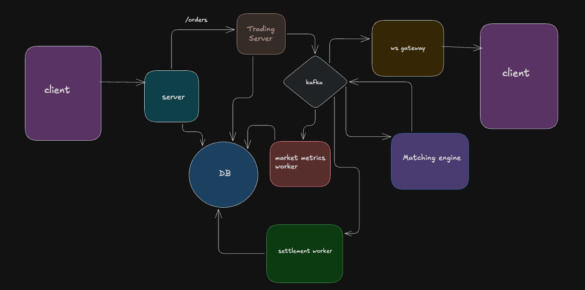

# ⚡ Centralized Exchange (CEX) — Real-Time Trading Engine

A high-performance, event-driven **Centralized Exchange** built from scratch using Node.js, Express.js, Next.js,Kafka, Redis, WebSockets, and in-memory matching engine logic.  
This project demonstrates how a real CEX operates — from **order creation, matching, persistence**, to **real-time market updates** for connected clients.

---

## 🧱 Architecture

---

## Tech Stack

Backend : Node.js, Express.js, Kafka, Redis, WebSockets, Prisma

Frontend : Next.js, TanStack Query, TailwindCSS

---